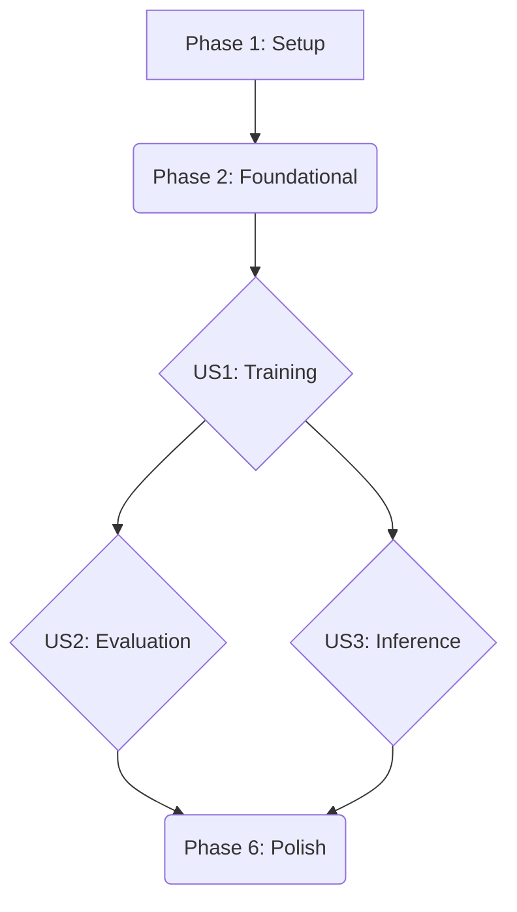

# C-BERT Replication Tasks

This document outlines the development tasks for replicating the C-BERT experiment, organized by feature priority.

## Implementation Strategy

The implementation will be phased, with each phase corresponding to a user story from the feature specification. This allows for incremental delivery and testing. The MVP (Minimum Viable Product) will be the completion of User Story 1, which delivers a trainable model.

**User Story Dependencies**:
- US1 (Training) must be completed before US2 (Evaluation) and US3 (Inference).
- US2 and US3 can be worked on in parallel after US1 is complete.

## Phase 1: Project Setup

*Goal: Initialize the project structure and install dependencies.*

- [x] T001 Create the source code directory structure outlined in `plan.md` (e.g., `src/cbert`, `src/cli`, `scripts`, `tests`).
- [ ] T002 Create the `requirements.txt` file with primary dependencies: `torch`, `transformers`, `sentencepiece`, `clang`.
- [ ] T003 Implement the corpus download script in `scripts/download_corpus.py` to clone the top-100 starred C-language repositories from GitHub.

## Phase 2: Foundational Components

*Goal: Build the core, shared components required for all user stories.*

- [ ] T004 [P] Implement the `Char` and `KeyChar` tokenizers in `src/cbert/tokenizer.py`.
- [ ] T005 [P] Implement the `SentencePiece` tokenizer training and loading logic in `src/cbert/tokenizer.py`.
- [ ] T006 Implement the data pre-processing pipeline in `src/cbert/data.py` to iterate through the raw corpus and apply comment removal.
- [ ] T007 Define the BERT-base model architecture in `src/cbert/model.py` using the Hugging Face `transformers` library.
- [ ] T008 [P] Write unit tests for all three tokenizers in `tests/unit/test_tokenizer.py`.

## Phase 3: User Story 1 - Training the Model

*Goal: A researcher can start a training process for the C-BERT model on a specified C code dataset.*
*Independent Test: The `train.py` script successfully launches, logs training loss, and saves a model checkpoint to disk.*

- [ ] T009 [US1] Implement the core training loop, including checkpointing and automatic resumption logic, in `src/cbert/trainer.py`.
- [ ] T010 [US1] Implement metric logging (Loss, Accuracy) within the trainer in `src/cbert/trainer.py`.
- [ ] T011 [US1] Implement the CLI for training in `src/cli/train.py`, ensuring it parses all arguments defined in `contracts/cli.md`.
- [ ] T012 [US1] Write an integration test in `tests/integration/test_training.py` that runs a single training step on a small dummy dataset.

## Phase 4: User Story 2 - Evaluating the Model

*Goal: A researcher can evaluate a trained C-BERT model on a held-out test set.*
*Independent Test: The `evaluate.py` script can load a trained model checkpoint and output evaluation metrics in the specified format.*

- [ ] T013 [P] [US2] Implement the evaluation logic for the `ast` and `vi` tasks in `src/cli/evaluate.py`.
- [ ] T014 [P] [US2] Write unit tests for the evaluation metric calculations in `tests/unit/test_evaluation.py`.
- [ ] T015 [US2] Write an integration test in `tests/integration/test_evaluation.py` that loads a dummy checkpoint and runs the evaluation script.

## Phase 5: User Story 3 - Using the Pre-trained Model

*Goal: A developer or researcher can load the pre-trained C-BERT model to extract embeddings from a given C code snippet.*
*Independent Test: A script can successfully load a trained model and output a vector embedding for a sample C function.*

- [ ] T016 [US3] Create a simple CLI utility in `src/cli/embed.py` that takes a string of C code and prints the resulting embedding to stdout.
- [ ] T017 [P] [US3] Create a Jupyter Notebook in `notebooks/embedding_example.ipynb` that provides a more detailed, documented example of loading the model and using it for inference.

## Phase 6: Polish & Documentation

*Goal: Finalize documentation and ensure code quality.*

- [ ] T018 [P] Populate the root `README.md` with content from `quickstart.md` and other relevant documentation.
- [ ] T019 [P] Review and finalize all docstrings and type hints throughout the `src/cbert` library.
- [ ] T020 Run the final linting and code formatting pass across the entire project.

## Parallel Execution Opportunities

- **During Phase 2**: The three tokenizer implementations (T004, T005) and their tests (T008) can be developed in parallel.
- **After Phase 3 (US1)**: Work on US2 (Evaluation) and US3 (Inference) can happen in parallel as they both depend only on a trained model checkpoint from US1.
